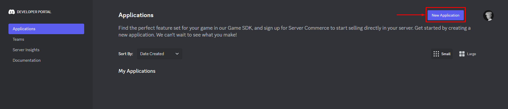
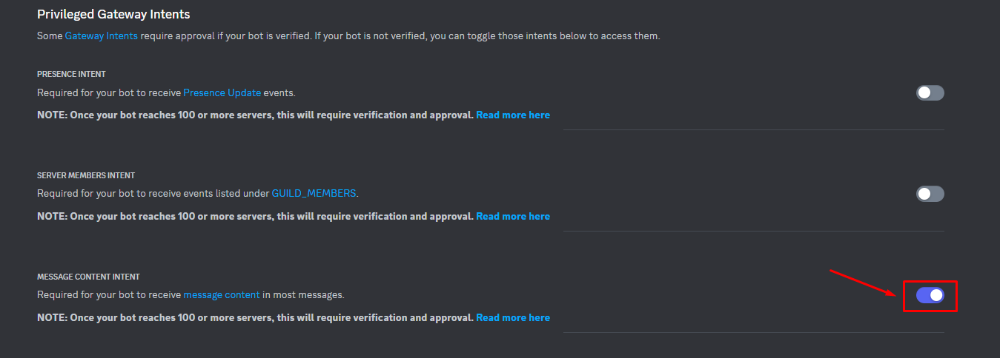

# Installation

* **Stop** din server.
* Put **DiscordLink.jar** filen ind i din **/plugins** mappen.
* **Start** din server.
* **Indsæt** licensnøgle i **config.yml**
*   **Opret en bot på** [**https://discord.com/developers/applications**](https://discord.com/developers/applications)

    *

        <figure><figcaption>
Opret Application på Discord
</figcaption></figure>

        <figure><figcaption>
Sørg for at aktivere "Message Content Intent" 
</figcaption></figure>

        <figure><figcaption>
Botten skal have disse scopes - særlig "applications.commands" er vigtigt!
</figcaption></figure>

        <figure><figcaption>
Disse permissions skal botten mindst have.
</figcaption></figure>

* Udfyld \`config.yml\` med de nødvendige oplysninger.
* **Genstart** din server.


Bemærk det godt kan tage op til 10 minutter før Discord har registeret de nye slash commands.

