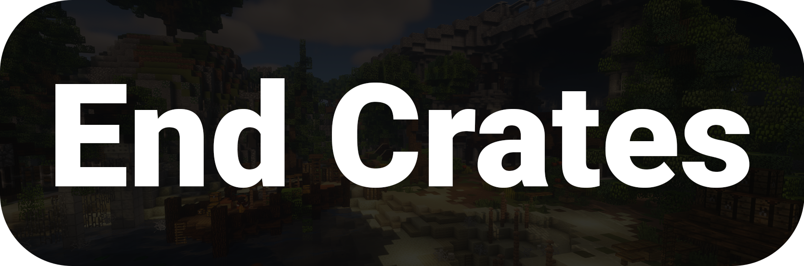

# End Crates

<figure><figcaption></figcaption></figure>



## Beskrivelse 

**End Crates** er et nemt-at-bruge crate plugin, som giver dine spillere mulighed for at prøve en limited crate. Det er nemt at konfigurere, så selv en serverejer uden specielt meget erfaring kan sætte det op.

## Features

* Konfigurabelt design
* Admin kommandoer
* Nemt at bruge og opsætte

## Commands & Permissions

<table data-header-hidden><thead><tr><th width="169">Beskrivelse</th><th width="176">Command</th><th width="365.3333333333333">Permission</th></tr></thead><tbody><tr><td><strong>Command</strong></td><td><strong>Permission</strong></td><td><strong>Beskrivelse</strong></td></tr><tr><td>/endcrates</td><td>endcrates.admin</td><td>Admin kommando for pluginet.</td></tr></tbody></table>

## Dependencies

* [PlexCore](https://plexhost.dk/plugins) (minimum v3.7)

## Links

* McSkripts: [https://mcskripts.net/view/id/5751](https://mcskripts.net/view/id/5751)

